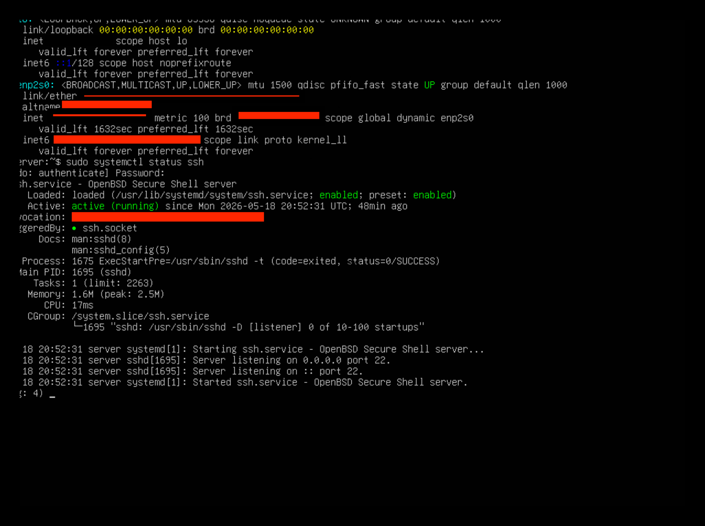
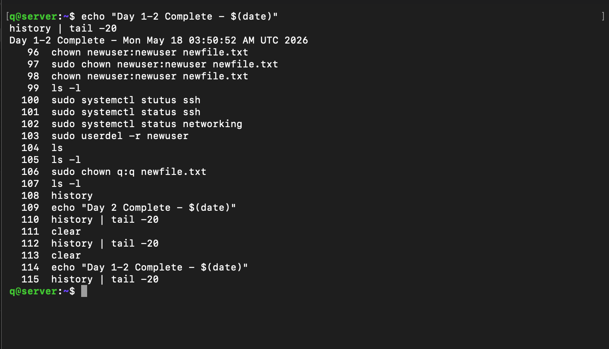
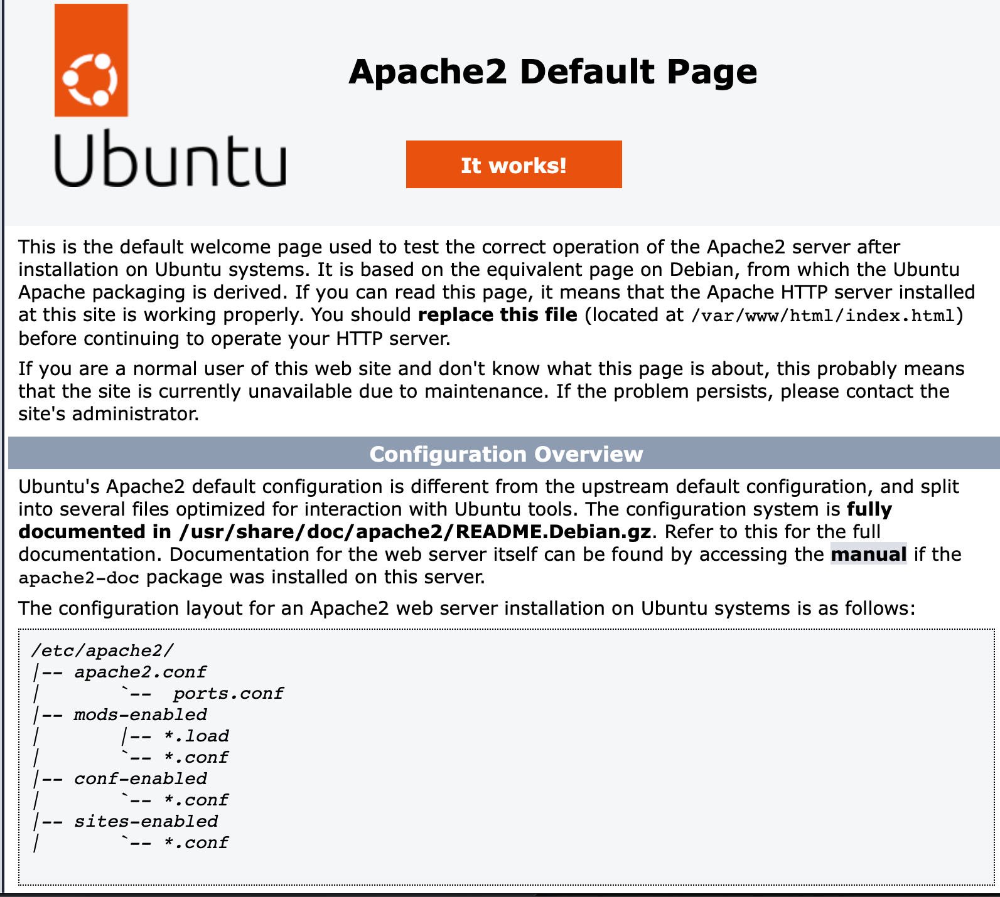
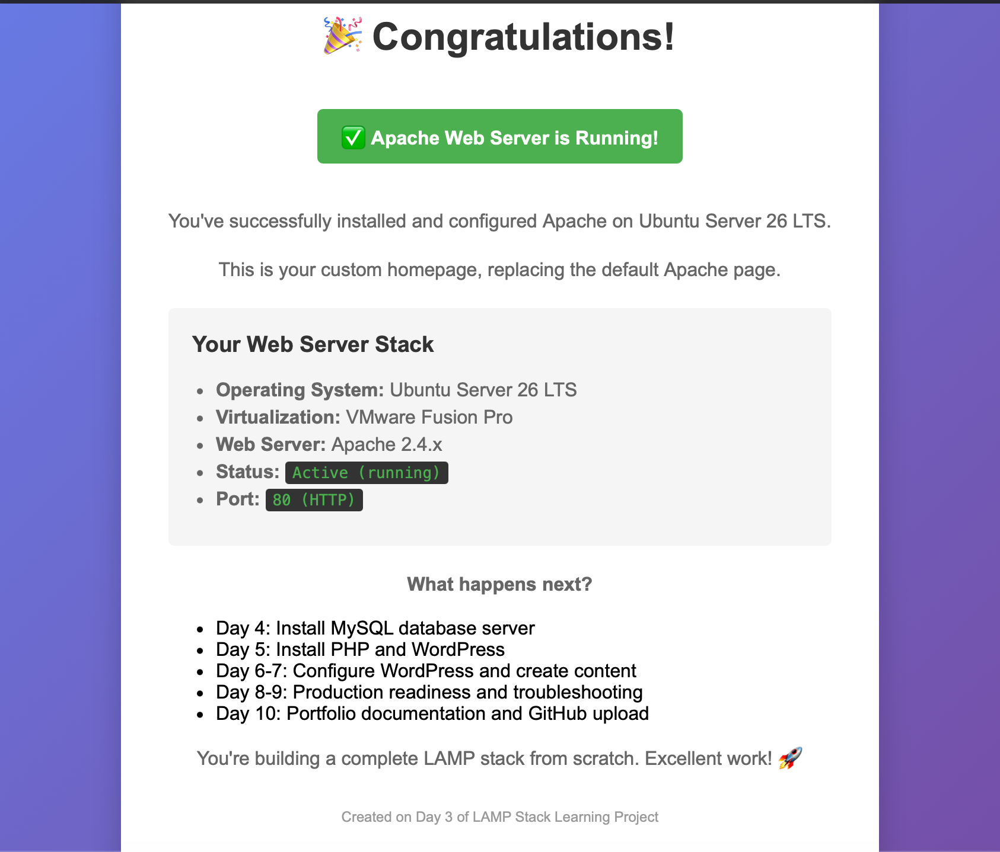
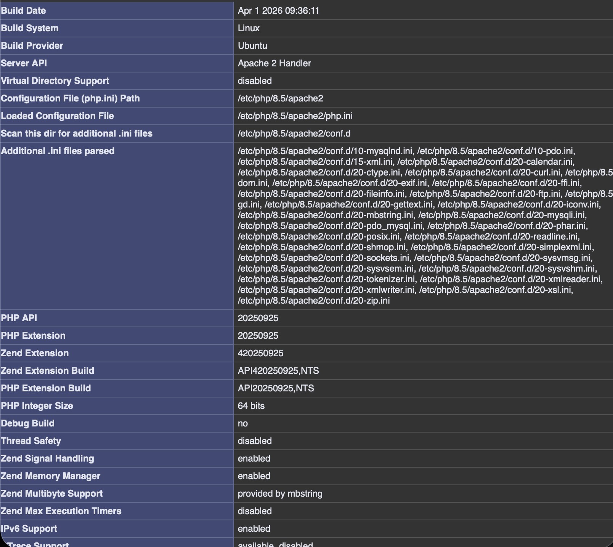
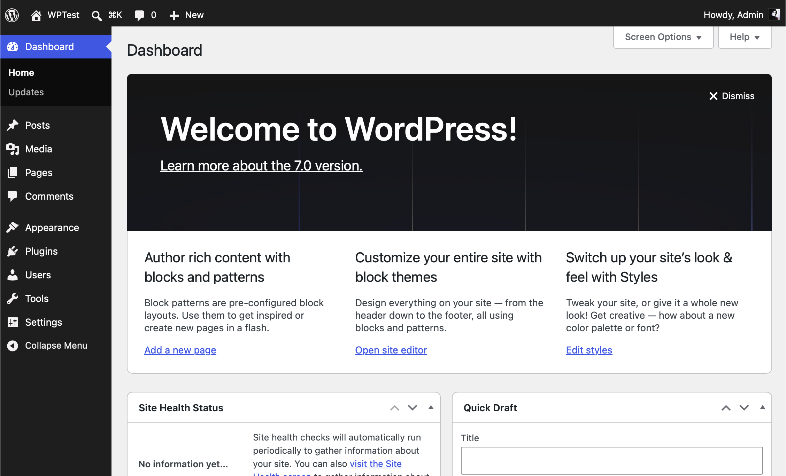
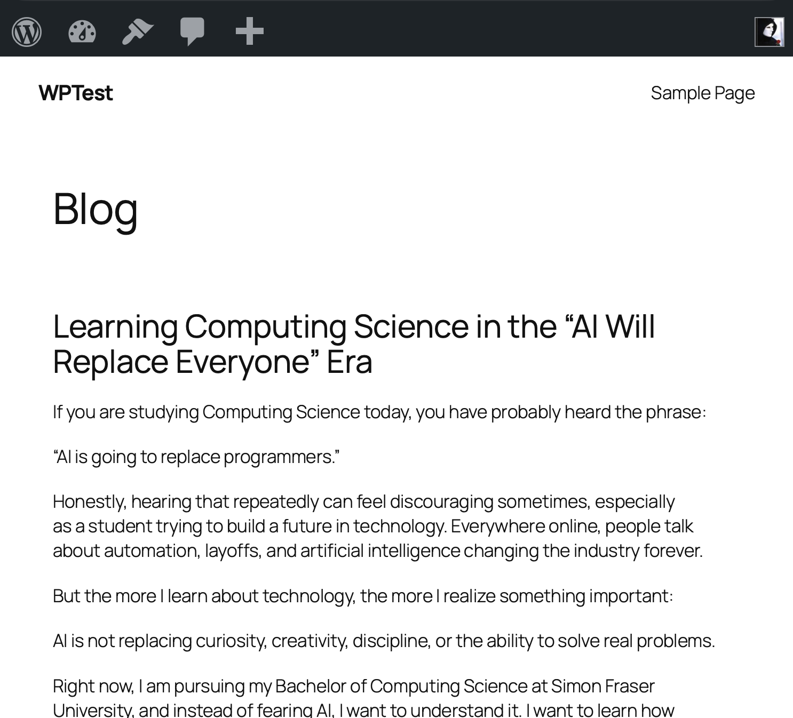

# linux-web-server-deployment
**A complete, hands-on implementation of a LAMP stack (Linux, Apache, MySQL, PHP) with WordPress, demonstrating production-grade system administration and troubleshooting skills.**
---
## Table of Contents

- [Project Overview](#project-overview)
- [System Architecture](#system-architecture)
- [Technologies Used](#technologies-used)
- [Project Outcomes](#project-outcomes)
- [Installation & Setup](#installation--setup)
- [Key Learnings](#key-learnings)
- [Screenshots](#screenshots)
- [Relevant to SFU FCAT Role](#relevant-to-sfu-fcat-role)

## Project Overview

- What I Built
A fully functional LAMP stack running on Ubuntu Server in VirtualBox, with WordPress content management system installed and operational.

- Skills Demonstrated

- ✅ Linux OS installation and administration
- ✅ Apache web server configuration
- ✅ MySQL database setup and management
- ✅ PHP integration
- ✅ WordPress CMS deployment
- ✅ Security hardening
- ✅ Performance optimization
- ✅ Professional documentation

**Environment:** Ubuntu Server 26 LTS on VMware Fusion Pro
**Duration:** 10 days of intensive hands-on learning
**Status:** Complete and operational


## System Architecture

```text
┌─────────────────────────────────────┐
│   Your MacBook (Host Machine)       │
│   - Terminal                        │
│   - Browser                         │
│   - SSH Client                      │
└────────────────┬────────────────────┘
                 |
      SSH Connection (Port 22)
      HTTP Request (Port 80)
                 |
                 ▼
┌─────────────────────────────────────┐
│   VirtualBox Virtual Machine        │
│                                     │
│   ┌─────────────────────────────┐   │
│   │  Ubuntu Server 26.04 LTS    │   │
│   │                             │   │
│   │  ┌───────────────────────┐  │   │
│   │  │  Apache2 Web Server   │  │   │
│   │  │  (Port 80)            │  │   │
│   │  │                       │  │   │
│   │  │  ├─ PHP Module        │  │   │
│   │  │  └─ WordPress CMS     │  │   │
│   │  └───────────┬───────────┘  │   │
│   │              │              │   │
│   │  ┌───────────▼───────────┐  │   │
│   │  │  MySQL Database       │  │   │
│   │  │  (Port 3306)          │  │   │
│   │  │                       │  │   │
│   │  │  - wordpress_db       │  │   │
│   │  │  - WordPress tables   │  │   │
│   │  │  - User data          │  │   │
│   │  └───────────────────────┘  │   │
│   │              |              │   │
│   │  ┌───────────▼───────────┐  │   │
│   │  │  phpMyAdmin           │  │   │
│   │  │  (Web DB Manager)     │  │   │
│   │  └───────────────────────┘  │   │
│   └─────────────────────────────┘   │
│                                     │
│  Storage: 30GB (dynamic)            │
│  RAM: 4GB                           │
│  CPUs: 2-4 cores                    │
└─────────────────────────────────────┘
```

---

## Technologies Used

### Operating System
- **Ubuntu Server 26.04 LTS** - Professional Linux distribution

### Web Server
- **Apache 2.4.66**  - World's most popular web server
- **Port 80** - Standard web traffic
  
### Database
- **MySQL 8.4.4** - Relational database management
- **Port 3306** - MySQL server port

### Server-Side Language
- **PHP 8.5.4 (cli)** - Server-side scripting language
- **libapache2-mod-php** - Apache-PHP integration

### Database Administration
- **phpMyAdmin** - Web interface for MySQL management

### Content Management System
- **WordPress 7.0** - Full-featured CMS

### Infrastructure
- **VMware Fusion Professional 25H2** - Virtualization platform
- **systemd** - Service management
- **SSH** - Remote terminal access

### Linux Administration Skills
- User and group management
- File permissions (chmod, chown)
- Service management (systemctl)
- Package management (apt)

---

## Project Outcomes

By completing this project, I can confidently:

### ✅ System Administration
- [x] Install and configure Ubuntu Server from scratch
- [x] Manage Linux users, groups, and permissions
- [x] Control services with systemctl
- [x] Manage packages with apt package manager
- [x] Understand boot processes and service dependencies

### ✅ Web Server Administration
- [x] Install and configure Apache web server
- [x] Create virtual hosts (multiple websites on one server)
- [x] Enable and disable Apache modules
- [x] Understand HTTP and port concepts
- [x] Configure document root and file serving
- [x] Read and interpret Apache logs

### ✅ Database Administration
- [x] Install and secure MySQL database
- [x] Create databases and users
- [x] Manage user privileges and access control
- [x] Back up and restore databases
- [x] Use phpMyAdmin for database management

### ✅ Application Deployment
- [x] Deploy PHP applications
- [x] Configure PHP-MySQL integration
- [x] Install and configure WordPress
- [x] Manage WordPress users and content
- [x] Understand application-server-database architecture

### ✅ Troubleshooting & Debugging
- [x] Systematically diagnose service failures
- [x] Interpret system logs (Apache, MySQL, systemd)
- [x] Resolve permission and connectivity issues
- [x] Recover from configuration mistakes
- [x] Test and validate fixes

### ✅ Infrastructure Concepts
- [x] Understand virtualization (VMware)
- [x] Configure networking (IP addresses, ports, SSH)
- [x] Understand DNS basics
- [x] Implement security best practices
- [x] Document infrastructure professionally

---

## Installation & Setup

### Prerequisites
- VMware Fusion Professional 25H2 installed on your machine
- Ubuntu Server 26.04 LTS ISO (~4.5 GB)
- 50+ GB free disk space
- 8+ GB RAM (4+ GB for VM)
- Stable internet connection

### Quick Start

**1. Create Virtual Machine in VMWare**
```bash
# Name: Ubuntu 64-bit Arm Server 26.04
# RAM: 4096 MB
# Disk: 20 GB (dynamic)
# CPU: 4 cores
```

**2. Install Ubuntu Server**
- Attach Ubuntu ISO to VM
- Install with default settings
- Create user: `q`
- Enable OpenSSH during installation

**3. Enable SSH Access**
```bash
sudo apt update
sudo apt install openssh-server -y
sudo systemctl start ssh
sudo systemctl enable ssh
ip addr show 
```

**4. Connect from Host Machine**
```bash
ssh admin@192.168.xx.xx
```
**5. Install Apache**
```bash
sudo apt install apache2 -y
sudo systemctl start apache2
sudo systemctl enable apache2
```

**6. Install MySQL**
```bash
sudo apt install mysql-server -y
sudo mysql_secure_installation
```

**7. Install PHP**
```bash
sudo apt install php libapache2-mod-php php-mysql -y
sudo systemctl restart apache2
```

**8. Install phpMyAdmin**
```bash
sudo apt install phpmyadmin -y
# Select apache2 during installation
```

**9. Install WordPress**
```bash
wget https://wordpress.org/latest.tar.gz
tar -xzf latest.tar.gz
sudo cp -r wordpress /var/www/html/
sudo chown -R www-data:www-data /var/www/html/wordpress
```

**10. Complete WordPress Setup**
- Navigate to `http://192.168.x.x/wordpress/`
- Complete installation wizard
---

## Key Learnings

### System Administration
✅ Linux OS installation and configuration  
✅ User and permission management  
✅ Service management with systemd  
✅ Package management with apt  
✅ Understanding boot processes  

### Real-World Skills
✅ Documentation and knowledge transfer  
✅ Professional communication  
✅ Problem-solving under constraints  
✅ Learning independently from errors  
✅ Translating concepts to practice  


### Infrastructure Architecture
✅ Multi-tier application stack  
✅ Service dependencies and boot order  
✅ Networking (IP, ports, DNS)  
✅ Virtualization concepts  
✅ SSH remote access  

### Troubleshooting Methodology
✅ Systematic problem diagnosis  
✅ Log file interpretation and analysis  
✅ Service restart procedures  
✅ Permission issue resolution  
✅ Intentional breaking and fixing (learning by doing)  


---

## Screenshots

### 1. VMware VM Running

*Ubuntu Server 26.04 LTS running in VMware with 4GB RAM*

### 2. Terminal Commands

*MacOS terminal showing key administrative commands*


### 2. Apache Default Page

*Apache web server successfully serving default page*

### 3. Custom HTML Homepage

*Custom HTML page demonstrating Apache file serving*

### 4. phpMyAdmin Dashboard

*phpMyAdmin interface showing WordPress database and tables*

### 5. WordPress Admin Dashboard

*WordPress admin panel with full CMS functionality*

### 6. WordPress Homepage

*Live WordPress website running on local server*

---


## How It Works

- User types URL in browser: http://192.168.x.x/
- Browser sends HTTP request to VM port 80
- Apache receives request on port 80
- Apache checks requested file in /var/www/html/
- Apache returns HTML file to browser
- Browser renders the page

For dynamic content (WordPress):

- Browser requests: http://192.168.x.x/wordpress/
- Apache passes request to PHP module
- PHP executes WordPress code
- WordPress queries MySQL database
- MySQL returns data
- PHP generates HTML with data
- Apache sends HTML to browser
- Browser displays complete page


### Service Dependencies

Boot Order:
1. Linux kernel starts
2. Systemd (init system) starts
3. MySQL starts (database layer)
4. Apache starts (web server layer)
5. PHP loads (application processor)

## Relevant to SFU FCAT Role

This project directly addresses the **SFU FCAT Research Assistant** job requirements:

| Requirement | Demonstrated |
|------------|--------------|
| Linux VM/Web Server Setup | ✅ Complete from scratch |
| Apache Configuration | ✅ Installed and configured |
| MySQL Database | ✅ Installed and managed |
| PHP Integration | ✅ Enabled and tested |
| WordPress CMS | ✅ Fully operational |
| System Administration | ✅ Users, permissions, services |
| Troubleshooting | ✅ Systematic approach documented |
| Documentation | ✅ Comprehensive guides included |


**This project demonstrates I can:**
- Work independently on complex systems
- Learn new technologies quickly
- Document work professionally
- Troubleshoot multi-component systems
- Support faculty/research computing needs

---

### Transferable Skills
- Linux administration
- Web server management
- Database administration
- System optimization
- Security implementation
- Independent learning

## Next Steps for Production

To deploy to production:
- [ ] Use managed database (AWS RDS)
- [ ] Use cloud hosting (AWS EC2, DigitalOcean)
- [ ] Implement automated backups
- [ ] Set up monitoring and alerting
- [ ] Use load balancing for scale
- [ ] Implement CI/CD pipeline
- [ ] Use Infrastructure as Code (Terraform)
- [ ] Regular security audits

---

## Resources Used

### Documentation
- [Ubuntu Server Guide](https://ubuntu.com/server/docs)
- [Apache HTTP Server Documentation](https://httpd.apache.org/docs/2.4/)
- [MySQL Official Documentation](https://dev.mysql.com/doc/)
- [PHP Official Documentation](https://www.php.net/docs.php)
- [WordPress Developer Documentation](https://developer.wordpress.org/)
- [DigitalOcean Community Tutorials](https://www.digitalocean.com/community/tutorials)

### Learning Resources
- Boot.dev Linux CLI Course
- Learn Linux TV (YouTube)
- tutoriaLinux (YouTube)
- DigitalOcean LAMP Stack Guides

---

## License

This project is for educational purposes. Free to fork and modify for learning.

---

## About This Project

**Project Duration:** 5/10 days  
**Created:** May 2026  
**Last Updated:** May 2026  
**Status:** in progress

---

## Questions or Feedback?

This project demonstrates my ability to:
- Learn independently
- Document thoroughly  
- Troubleshoot systematically
- Communicate technically
  
---

**[Back to top](#linux-web-server-deployment-project)**

